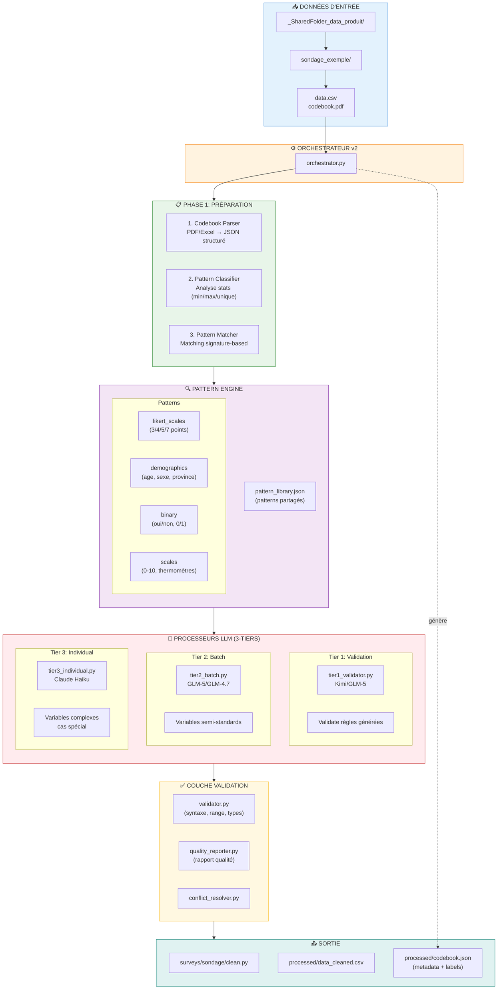
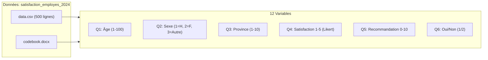
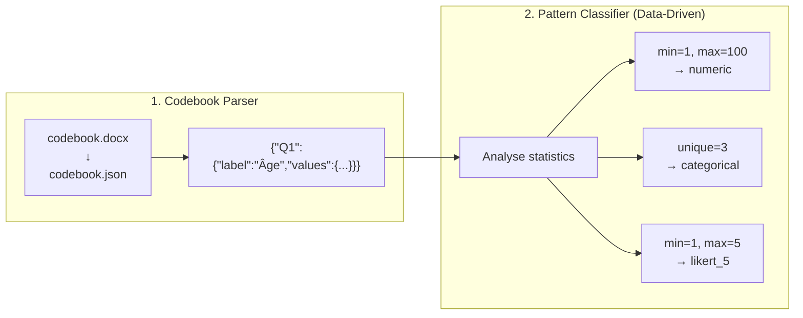
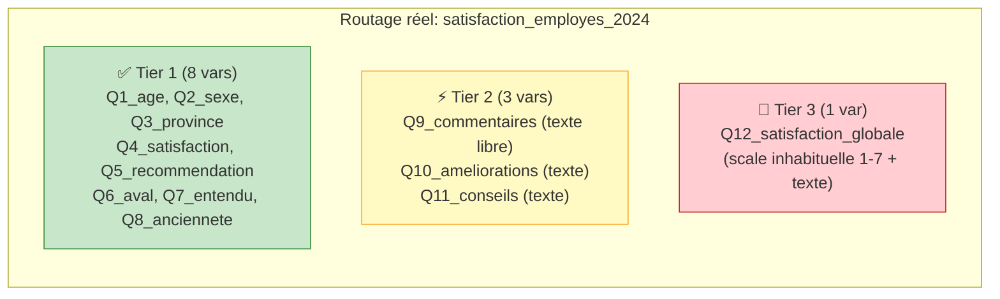
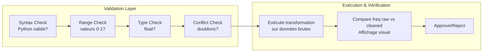
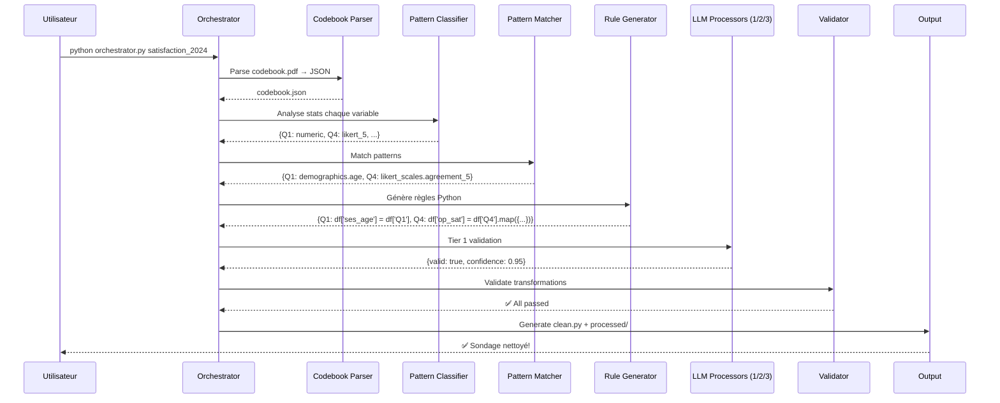

# Architecture Survey Cleaner v2

## Vue d'ensemble du Flux de Traitement



---

## Exemple: Sondage Fictif "satisfaction_employes_2024"

### Données d'entrée



### Phase 1: Parsing & Classification



**Exemple de résultat:**
| Variable | Stats | Pattern Détecté |
|----------|-------|-----------------|
| Q1_age | min=18, max=85 | `numeric` → Match: `demographics.age` |
| Q2_sexe | unique=3 | `categorical` → Match: `demographics.gender` |
| Q3_province | unique=10 | `categorical` → Match: `demographics.province` |
| Q4_satisfaction | min=1, max=5 | `likert_5` → Match: `likert_scales.agreement_5` |
| Q5_recommendation | min=0, max=10 | `scale_0_10` → Match: `scales.nps` |
| Q6_aval_entreprise | unique=2 | `binary` → Match: `binary.yes_no` |

### Phase 2: Génération des Règles via Patterns

```mermaid
flowchart TB
    subgraph RULE_GEN["Rule Generator"]
        RG1["Pattern + Codebook<br/>↓<br/>Règles Python"]
    end

    subgraph EXAMPLE["Exemple: Q4_satisfaction"]
        E1["Pattern: likert_scales.agreement_5"]
        E2["Codebook: 1=Très insatisfait<br/>2=Insatisfait<br/>3=Neutre<br/>4=Satisfait<br/>5=Très satisfait"]
        E3["↓ Génère"]
        E4["```python<br/>df['op_satisfaction'] = df['Q4'].map({<br/>    1.0: 0.0,<br/>    2.0: 0.25,<br/>    3.0: 0.5,<br/>    4.0: 0.75,<br/>    5.0: 1.0<br/>})<br/>```"]
    end

    RG1 --> E1 & E2
    E1 --> E3
    E2 --> E3
    E3 --> E4
```

### Phase 3: Routage LLM 3-Tiers

```mermaid
flowchart TB
    subgraph ROUTING["Tier Routing"]
        R1{"Type de variable?"}
        R2["Match pattern?<br/>→ règles claires"]
        R3["Cas spécial?<br/>→ borderline"]
        R4["Complexe?<br/>→ edge case"]
    end

    subgraph TIER1["Tier 1: Validation (Gratuit/Economic)"]
        T1A["Kimi/GLM-5"]
        T1B["Valide les règles<br/>générées par patterns"]
        T1C["```json<br/>{&quot;valid&quot;: true,<br/> &quot;confidence&quot;: 0.95}<br/>```"]
    end

    subgraph TIER2["Tier 2: Batch (Semi-auto)"]
        T2A["GLM-5/GLM-4.7"]
        T2B["Traite 5-10 variables<br/>similaires ensemble"]
        T2C["Prompt cache<br/>codebook + patterns"]
    end

    subgraph TIER3["Tier 3: Individual (Complexe)"]
        T3A["Claude Haiku"]
        T3B["Variables difficiles<br/>cas edge"]
        T3C["Coût plus élevé<br/>mais nécessaire"]
    end

    R1 --> R2 & R3 & R4
    R2 --> TIER1
    R3 --> TIER2
    R4 --> TIER3
```

### Exemple de Routing pour notre sondage:



### Phase 4: Validation & Nettoyage



**Exemple de validation Q4_satisfaction:**

```
Avant (raw):          Après (cleaned):
1: 45 (9%)     →     0.0: 45 (9%)    [Très insatisfait]
2: 78 (16%)    →     0.25: 78 (16%)  [Insatisfait]
3: 120 (24%)   →     0.5: 120 (24%)  [Neutre]
4: 156 (31%)   →     0.75: 156 (31%) [Satisfait]
5: 101 (20%)   →     1.0: 101 (20%)  [Très satisfait]

✅ Validation passed!
```

### Phase 5: Sortie Finale

```mermaid
flowchart TB
    subgraph OUTPUT_STRUCTURE["Structure de Sortie"]
        O1["surveys/satisfaction_employes_2024/"]
        O2["├── clean.py              # Script nettoyeur"]
        O3["├── VARIABLE_METADATA    # Labels pour LLMs"]
        O4["└── processed/"]
        O5["    ├── data_cleaned.csv  # Données nettoyées"]
        O6["    └── codebook.json    # Codebook standardisé"]
    end

    subgraph CLEAN_PY["clean.py (extrait)"]
        CP["```python<br/>VARIABLE_METADATA = {<br/>  'ses_age': {<br/>    'original': 'Q1',<br/>    'type': 'numeric'<br/>  },<br/>  'op_satisfaction': {<br/>    'original': 'Q4',<br/>    'type': 'likert_5',<br/>    'labels': {<br/>      0.0: 'Très insatisfait',<br/>      1.0: 'Très satisfait'<br/>    }<br/>  }<br/>}<br/><br/>def clean_data(df):<br/>  df_clean = pd.DataFrame()<br/>  df_clean['ses_age'] = df['Q1']<br/>  df_clean['op_satisfaction'] = ...<br/>  return df_clean<br/>```"]
    end

    subgraph CODEBOOK_JSON["codebook.json (généré)"]
        CJ["```json<br/>{<br/>  &quot;survey_id&quot;: &quot;satisfaction_2024&quot;,<br/>  &quot;variables&quot;: {<br/>    &quot;ses_age&quot;: {<br/>      &quot;original&quot;: &quot;Q1&quot;,<br/>      &quot;label&quot;: &quot;Âge&quot;,<br/>      &quot;type&quot;: &quot;numeric&quot;<br/>    },<br/>    &quot;op_satisfaction&quot;: {<br/>      &quot;original&quot;: &quot;Q4&quot;,<br/>      &quot;label&quot;: &quot;Satisfaction&quot;,<br/>      &quot;type&quot;: &quot;likert_5&quot;,<br/>      &quot;scale&quot;: [0, 1],<br/>      &quot;labels&quot;: {<br/>        &quot;0.0&quot;: &quot;Très insatisfait&quot;,<br/>        &quot;0.25&quot;: &quot;Insatisfait&quot;,<br/>        &quot;0.5&quot;: &quot;Neutre&quot;,<br/>        &quot;0.75&quot;: &quot;Satisfait&quot;,<br/>        &quot;1.0&quot;: &quot;Très satisfait&quot;<br/>      }<br/>    }<br/>  }<br/>}<br/>```"]
    end

    O1 --> O2 & O3 & O4
    O4 --> O5 & O6
```

---

## Résumé du Flux v2



---

## Métriques Attendues (v2)

| Métrique | Valeur |
|----------|--------|
| Tokens/sondage | ~25K |
| Coût/sondage | ~$0.008 |
| Temps/sondage | ~4 min |
| Couverture patterns | 80% auto |
